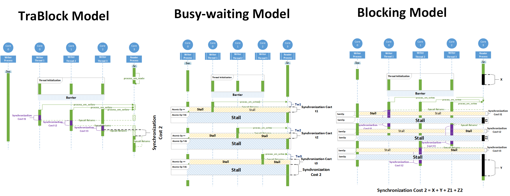

[](http://pepy.tech/count/stronghold)

`TraBlcok` is a novel IPC model that integrates both synchronization and data transfer into a single set of low cost and well-defined system calls.

Developed to submit it as a master thesis project result in [`OSDI-2021`](https://www.usenix.org/conference/osdi21). *This is not the whole project. but some demo to show that what this project is about*


**Usage**
---
You should apply the git diff and replace the codes as patches to the original Linux kernel codes. 
This could is developed when kernel 5.14 was released.


**Configuration Options**
---

1. After applying one patch you can execute the benchmarks that are in [`IPC-benchmarking`](https://github.com/Amirsorouri00/ipc-benchmarking/tree/732b26a04cdecfc82d34a4ca3c03a77ba064026f). Note that:
    + The following commands would be usefull to test the kernel in a better mood...
        ```
	        $ dmesg -w
        	$ chrt -r -p <priority> <pid>   // changes the priority of the processes in the runtime-queue(rq)
	```
 
**How to Contribute**
---

1. Clone repo and create a new branch: `$ git checkout https://github.com/Amirsorouri00/trablock -b name_for_new_branch`.
2. Make changes and test
3. Submit Pull Request with comprehensive description of changes

**Acknowledgements**
---

+ [@amirsorouri00](https://www.github.com/amirsorouri00) for codebase and final model.

**Donations**
---

This is free, open-source software. If you'd like to support the development of future projects, or say thanks for this one, you can donate BTC at `1FnJ8hRRNUtUavngswUD21dsFNezYLX5y9`.
